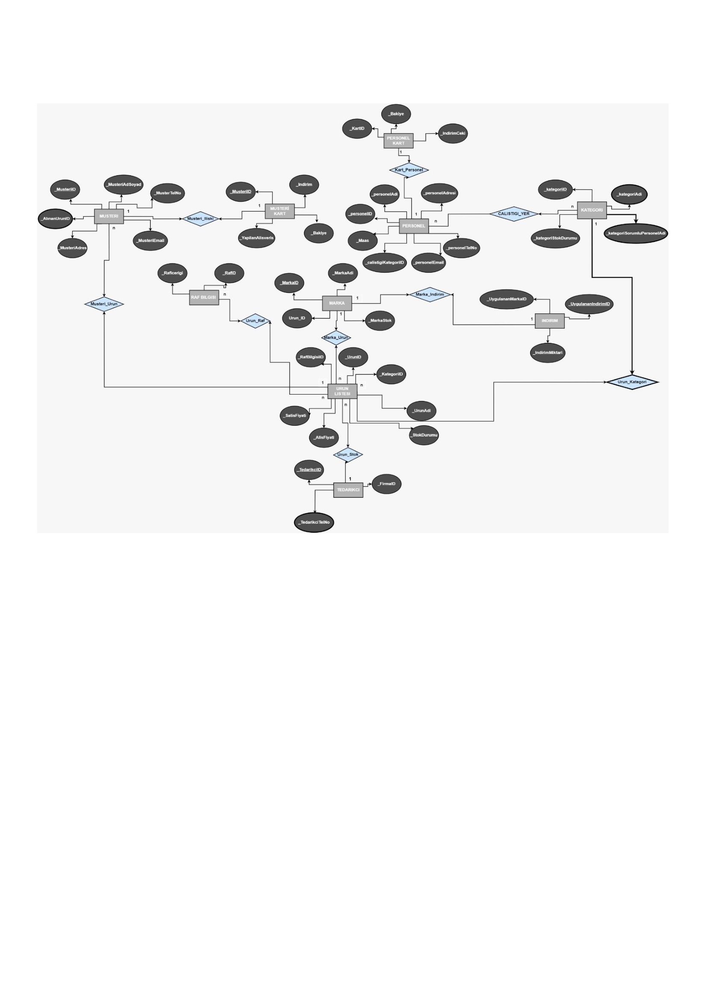

# Market Otomasyonu

## Proje Ekibi

- Menekşe Karakuş
- Hilal Karayiğit
- Yasemin Demirpolat

## Proje Tanımı ve Amacı

Bu proje, bir marketin veri yönetimini kolaylaştırmak ve müşteri deneyimini geliştirmek amacıyla bir veritabanı sistemi geliştirmeyi hedeflemektedir. Sistem, müşterilerin alışveriş geçmişini takip etmesine, indirim ve promosyonlardan faydalanmasına, ürünlerin ve tedarikçilerin yönetilmesine olanak tanıyacaktır.

## 1. Proje Gereksinimleri

### 1.1 Fonksiyonel Gereksinimler

Varlıklar arası ilişkiler nasıl kurulmuştur, bu ilişkilerde ne gibi sayısal kısıtlamalar uygulanmıştır? Farklı kullanıcı türleri için gereksinimler nelerdir?

- **Müşteri Yönetimi**: Müşterilerin kimlik bilgileri, kart bilgileri, indirimler ve alışveriş geçmişi yönetilecektir.
- **Personel Yönetimi**: Personelin kimlik bilgileri, indirimler ve yemek ücretleri gibi bilgiler tutulacaktır.
- **Ürün Yönetimi**: Ürünlerin kategori, stok durumu, fiyat bilgileri ve markaları hakkında detaylı bilgiler sunulacaktır.
- **Tedarikçi Yönetimi**: Tedarikçilerin kimlik bilgileri ve iletişim bilgileri yönetilecektir.
- **Raf Yönetimi**: Ürünlerin raflara yerleştirilmesi ve raf bilgileri tutulacaktır.

### 1.2 Kullanıcı Rolleri ve Yetkileri

a. **Müşteri**:

- Kart bilgilerini görüntüleyebilir.
- Alışveriş geçmişini inceleyebilir.
- İndirimleri uygulayabilir.

b. **Personel**:

- Ürünleri yönetebilir.
- Müşterilere yardımcı olabilir.

c. **Yönetici**:

- Tüm sistemin genel yönetimini yapabilir.
- Kullanıcı rolleri ve izinlerini düzenleyebilir.

## 2. Veri Yapıları

### Tablolar ve Alanlar

1. **Müşteriler**:

   - Müşteri_ID
   - Ad
   - Soyad
   - Kart Bilgileri
   - İndirimler
   - Alışveriş Geçmişi

2. **Personel**:

   - Personel_ID
   - Ad
   - Soyad
   - İndirim Bilgileri
   - Yemek Ücreti

3. **Ürünler**:

   - Ürün_ID
   - Kategori_ID
   - Stok Durumu
   - Alış Fiyatı
   - Satış Fiyatı
   - Raf_ID
   - Marka Bilgisi

4. **Kategoriler**:

   - Kategori_ID
   - Kategori Adı
   - Sorumlu Personel_ID
   - Stok Durumu

5. **Raflar**:

   - Raf_ID
   - Raf İçeriği

6. **Tedarikçiler**:

   - Tedarikçi_ID
   - Tedarikçi Adı
   - İletişim Bilgileri

7. **Markalar**:
   - Marka_ID
   - Marka Adı

## 3. Teknik Gereksinimler

- **Veritabanı Yönetim Sistemi (DBMS)**: SQL (MySQL, PostgreSQL vb.)
- **Güvenlik**: Verilerin şifrelenmesi ve yetkilendirme politikalarının uygulanması.
- **Yedekleme**: Düzenli veri yedekleme işlemleri.

## 4. Projede Yapılacak İşlemler

- Müşteri ve personel kayıt işlemleri.
- Ürün ekleme ve güncelleme işlemleri.
- Alışveriş kayıtlarının yönetimi.
- İndirim ve promosyon uygulama işlemleri.
- Raporlama ve analiz işlemleri.

  

### Tablolar ve Alanlar
1. *PERSONEL KART* (_KartID, _Bakiye, _IndirimCeki):
   - Market personelinin kimlik bilgilerini ve kart özelliklerini içerir.
   - _KartID, her personel kartını benzersiz bir şekilde tanımlar.
   - _Bakiye, personelin kartındaki para miktarını tutar.
   - _IndirimCeki, personelin kullanabileceği indirim çeki miktarını gösterir.

2. *MUSTERI* (_MusteriID, _MusteriAdSoyad, _MusteriTelNo, _MusteriEmail, _MusteriAdres, _AlinanUrunID):
   - Müşteri bilgilerini ve satın alınan ürünleri içerir.
   - _MusteriID, her müşteriyi benzersiz bir şekilde tanımlar.
   - _AlinanUrunID, müşterinin satın aldığı ürünleri belirtir.

3. *MUSTERIKART* (_MusteriID, _Indirim, _Bakiye, _YapilanAlisveris):
   - Müşteri kart bilgilerini içerir.
   - _Indirim, müşterinin kartına tanımlanan indirim oranını gösterir.
   - _YapilanAlisveris, müşterinin toplam alışveriş miktarını tutar.

4. *PERSONEL* (_personeID, _personelAdi, _personelAdresi, _personelTelNo, _personelEmail, _calistigiKategoriID, _Maas):
   - Market personelinin genel bilgilerini ve çalıştığı kategoriyi içerir.
   - _calistigiKategoriID, personelin çalıştığı kategoriyi belirtir.
   - _Maas, personelin maaş bilgisini içerir.

5. *KATEGORI* (_kategoriID, _kategoriAdi, _kategoriSorumluPersonelAdi, _kategoriStokDurumu):
   - Ürün kategorilerini içerir.
   - _kategoriID, her kategoriyi benzersiz bir şekilde tanımlar.
   - _kategoriSorumluPersonelAdi, kategoriye sorumlu olan personelin adını belirtir.
   - _kategoriStokDurumu, kategorinin genel stok durumunu gösterir.

6. *RAFBILGISI* (_RafID, _Raficerigi):
   - Rafların içeriğini ve hangi ürünlerin bulunduğunu içerir.
   - _RafID, her rafı benzersiz bir şekilde tanımlar.

7. *MARKA* (_MarkaID, _MarkaAdi, _MarkaStok, _UrunID):
   - Markette bulunan markaları içerir.
   - _MarkaID, her markayı benzersiz bir şekilde tanımlar.
   - _MarkaStok, markanın genel stok durumunu gösterir.

8. *INDIRIM* (_UygulananIndirimID, _UygulananMarkaID, _IndirimMiktari):
   - Uygulanan indirimleri ve hangi markalara uygulandığını içerir.
   - _UygulananIndirimID, her indirimi benzersiz bir şekilde tanımlar.
   - _IndirimMiktari, uygulanan indirim miktarını gösterir.

9. *URUNLISTESI Tablosu* (_UrunID, _KategoriID, _UrunAdi, _StokDurumu, _AlisFiyati, _SatisFiyati,
_RafBilgisiID):
- Markette bulunan ürünleri ve bu ürünlerin detaylarını içerir.
- _UrunID, her ürünü benzersiz bir şekilde tanımlar.
- _StokDurumu, ürünün stok durumunu gösterir.
- _RafBilgisiID, ürünün hangi rafta bulunduğunu belirtir.

10. *TEDARIKCI Tablosu* (_TedarikciID, _FirmaID, _TedarikciTelNo):
- Markete ürün tedarik eden tedarikçilerin bilgilerini içerir.
- _TedarikciID, her tedarikçiyi benzersiz bir şekilde tanımlar.

11. *CALISTIGI_YER Tablosu* (_kategoriID, _personelID):
- Personellerin çalıştığı kategorileri belirten ilişkisel tablo.

12. *URUN_RAF Tablosu* (_RafID, UrunID):
- Ürünlerin hangi rafta bulunduğunu belirten ilişkisel tablo.

*İlişkiler:*

- PERSONEL ve CALISTIGI_YER tabloları arasında 1 - n bir ilişki bulunmaktadır. Bir personel birden fazla
kategoride çalışabilir, ancak her kategoride bir personel sorumlu olabilir.

- URUNLISTESI ve KATEGORI tabloları arasında bir 1 - n ilişki vardır. Bir kategoriye ait birden fazla ürün
olabilir, ancak her ürün bir kategoriye aittir.

- URUN_RAF tablosu, URUNLISTESI ve RAFBILGISI tabloları arasında birleştirici bir tablo olarak
kullanılarak, her ürünün hangi rafta bulunduğunu belirtir.
